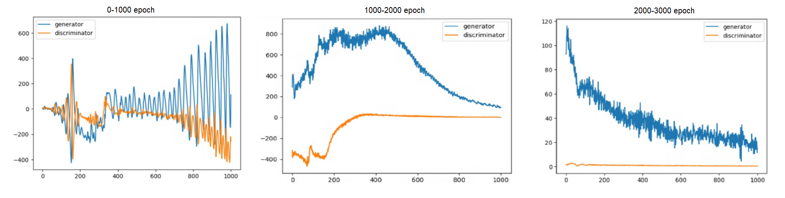
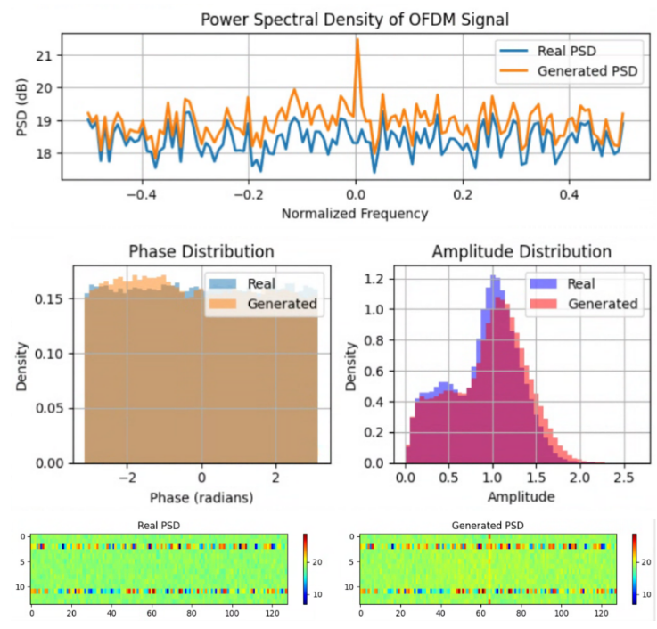

# 5G End-to-End system w/ Neural mapper, DeepRx and WGAN-based channel surrogate
---
## Overview
This repository contains code for an 5G End-to-End wireless communication system that integrates a simple neural mapper, neural receiver (DeepRx), and a CWGAN-GP (conditional Wasserstein GAN with gradient penalty) channel surrogate.

The use of GAN provides a differentiable approximation for an otherwise non-differentiable or unknown channel [2], since we want to allow gradients to propagate back to transmitter to enable E2E differentiability and facilitate E2E optimization. We use CWGAN-GP since it is known to train more stably, capture complex channel distributions and generate better data [6].
- **Neural mapper**: single-layer, linear, for trainable constellation
- **DeepRx**: detection, channel estimation & equalization, decoding.
- **CWGAN-GP**: generate frequency-domain received signal mapped in OFDM resource grid (**y_rg**), conditioned on transmitted signal (**x**) and channel frequency response (**h**)
  - simulation done on CDL-C
- **LDPC coding**: coded system
- **OFDM-Based transmission**: WGAN generator input and output resource grid


## Usage
See `Tensorflow-GPU for Ubuntu.pdf` for instruction on setting up environment including nvidia driver and cuda.
- Recommend Python 3.11^ and TensorFlow 2.14^
```
📂 5G-E2E-with-DeepRx-and-WGAN-channel
├── E2E-noGAN/                
│   ├── Neural_Receiver-64qam.ipynb         # Baseline without GAN, modified from sionna notebook[https://nvlabs.github.io/sionna/examples/Neural_Receiver.html]
│   ├── ...
├── WGAN/
|   ├── Neural_Reiver-64qam-refactor-wgan.ipynb             # Main file for the whole E2E system
|   ├── wgan-test-OFDM.ipynb             # Main file for the isolated WGAN testing
|   ├── Visual.ipynb             # Visuals for training and evaluation (e.g., Constellation plots, BER/BLER graphs)
|   ├── ...
└── README.md
```

## Results


## Notes on WGAN Training
- No BatchNorm in Generator, output layer linear activation (not tanh used in most GAN structure)
- Discriminator output layer also linear activation not sigmoid,
  - needs *Flatten* before output a scalar value because D makes decision based on all (14 ofdm*128 subcarriers) samples
- Due to observed tendency for Discriminator/Generator to overpower each other, training is done with manual update ratio tuning. We observe convergence after 3000 epochs. 
  - 1000 epoch (1D:1G)
  - 2000 epoch (1D:2G)
  - 3000 epoch (1D:2G)
  *For future work, schedulers or better update strategies can be tested.*
#### Sample testing output



## Future Work
- Validate system on MIMO configurations (wip)
- Can WGAN generalize to other channel conditions, or real-world measurements? (wip)
  - SDR prototyping
- Adaptive update strategy instead of manual tuning [7]


## References
- [1] E. Ayanoglu, K. Davaslioglu and Y. E. Sagduyu, "Machine Learning in NextG Networks via Generative Adversarial Networks," inIEEE Transactions on Cognitive Communications and Networking, vol. 8, no. 2, pp. 480-501, June 2022, doi: 10.1109/TCCN.2022.3153004
- [2] H. Ye, L. Liang, G. Y. Li and B. -H. Juang, "Deep Learning-Based End-to-End Wireless Communication Systems With Conditional GANs as Unknown Channels," inIEEE Transactions on Wireless Communications, vol. 19, no. 5, pp. 3133-3143, May 2020, doi: 10.1109/TWC.2020.2970707.
- [3] F. Euchner, J. Sanzi, M. Henninger and S. Ten Brink, "GAN-based Massive MIMO Channel Model Trained on Measured Data,"2024 27th International Workshop on Smart Antennas (WSA), Dresden, Germany, 2024, pp. 109-116, doi: 10.1109/WSA61681.2024.10511584.
- [4] I. Gulrajani, F. Ahmed et al. “Improved Training of Wasserstein GANs.”Neural Information Processing Systems(2017).
- [5] MatLab. “Train Wasserstein GAN with Gradient Penalty (WGAN-GP)” https://au.mathworks.com/help/deeplearning/ug/trainwasserstein-gan-with-gradient-penalty-wgan-gp.html
- [6] S. Dörner, M. Henninger, S. Cammerer and S. ten Brink, "WGAN-based Autoencoder Training Over-the-air,"2020 IEEE 21st International Workshop on Signal Processing Advances in Wireless Communications (SPAWC), Atlanta, GA, USA, 2020, pp. 1-5, doi: 10.1109/SPAWC48557.2020.9154335.
- [7] X. Ouyang, Y. Chen and G. Agam, "Accelerated WGAN update strategy with loss change rate balancing," 2021 IEEE Winter Conference on Applications of Computer Vision (WACV), Waikoloa, HI, USA, 2021, pp. 2545-2554, doi: 10.1109/WACV48630.2021.00259. 


